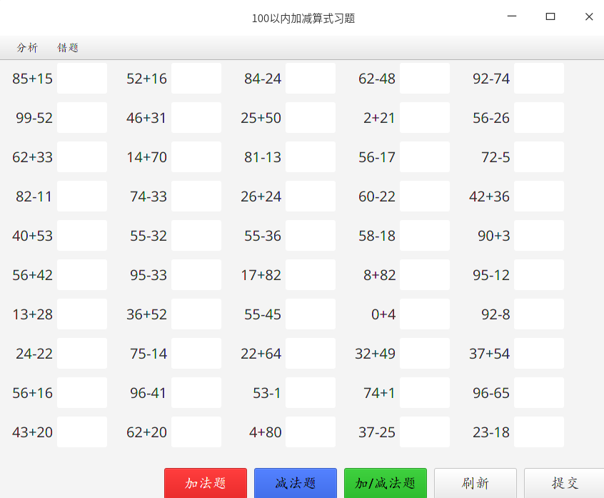
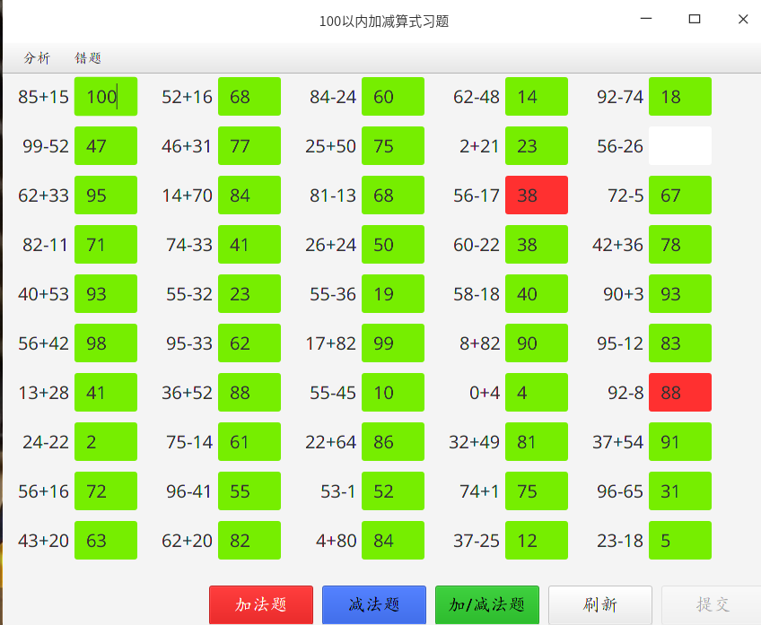
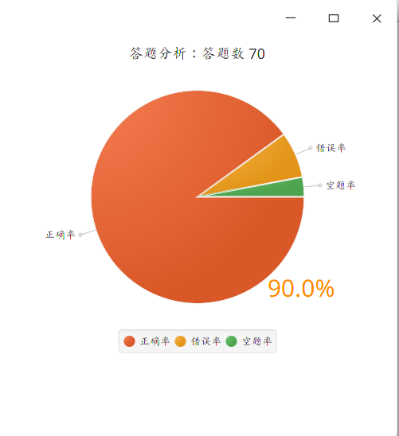
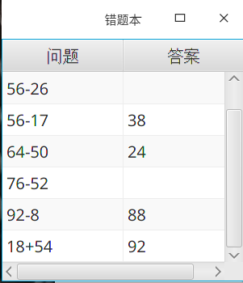

# Simple Math Exam
简单版的小学算数出题器，本程序的特点有：JavaFX实现可视化界面、设计模式、方便扩展功能等。
涉及的主要技术有：
- Java
- 设计模式
- JavaFX
- SQLite

## 功能
- 生成加/减算式
- 刷新算式
- 检查答案
- 分析历次提交结果（如饼状图）
- 记录错题（错题本）

## 效果图
### 界面

### 提交效果

### 饼状图分析

### 错题本

